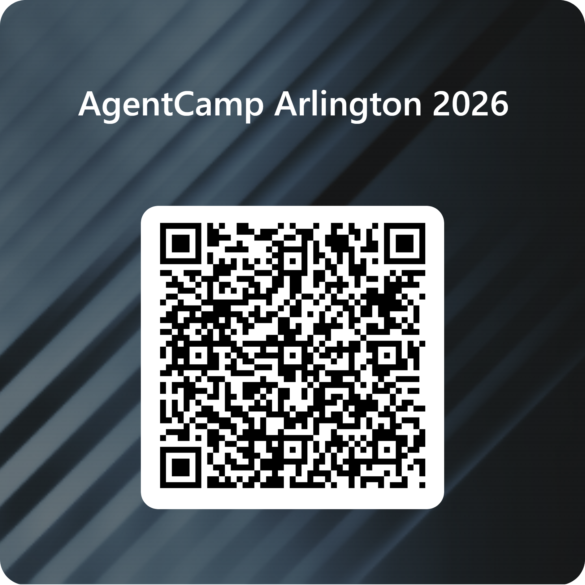

# AgentCamp Arlington
## https://www.aka.ms/agentcamp

[Survey Link](https://forms.office.com/r/d5hxi8mJxu)

## Event Information

- **Date:** Saturday, March 7, 2026
- **Time:** 9:00 AM - 3:00 PM CST
- **Venue:** UTA Science and Engineering Innovation and Research Building (SEIR), Room 198, 655 W Mitchell St, Arlington, TX 76010
- **Format:** In-Person Only
- **Registration:** [Register for this event](https://globalai.community/chapters/dallas/events/agentcamp-arlington/)
- **Event Page:** [https://globalai.community/chapters/dallas/events/agentcamp-arlington/](https://globalai.community/chapters/dallas/events/agentcamp-arlington/)
- **Organized by:** [Global AI Dallas](https://globalai.community/chapters/dallas/)

## 🚀 Hands-On Workshop: Building Agents with the Microsoft Agent Framework

Join us for an interactive, hands-on workshop where you'll learn how to design, build, and deploy intelligent agents using the Microsoft Agent Framework. This session is perfect for developers, AI enthusiasts, and professionals who want to explore practical applications of agent-based systems and gain real-world experience with Microsoft's cutting-edge tools.

### 1. Build and launch AI agents fast with Microsoft Foundry and the AI Toolkit [Link](https://github.com/giorgiosaez/agentcamp-msft/tree/main/build_and_launch_AI_agents_fast_with_Microsoft_Foundry_and_the_AI_Toolkit)

### 2. Workshop: Prototyping Multimodal Agents With Microsoft Foundry and the AI Toolkit [Link](https://github.com/giorgiosaez/agentcamp-msft/tree/main)

### 3. Build a Pizza Ordering Agent with Microsoft Foundry and MCP [Link](https://docs.globalai.community/agentcamp/content.html#_3-build-a-pizza-ordering-agent-with-microsoft-foundry-and-mcp)

## 🔑 What to Expect

- Guided walkthroughs of the Microsoft Agent Framework
- Step-by-step exercises to build and customize your own agents
- Best practices for integrating agents into enterprise workflows
- Live demos and collaborative coding sessions

## 💻 Important Note

This is a hands-on workshop, so please **bring your laptop** to fully participate in the exercises and coding labs. An Azure subscription will be provided for all participants to use during the workshop.

## 🌐 Who Should Attend

- Developers and engineers exploring AI agent technologies
- Technical trainers and consultants looking to expand their toolkit
- Students and professionals eager to gain practical experience with Microsoft AI solutions

## Topics

- Agent Framework
- Agents
- Microsoft AI

## Share Your AgentCamp Experience

If you share updates, photos, or learnings from your AgentCamp event, feel free to use our official hashtags and tag the Global AI Community.

- **Hashtags:** #AgentCamp #GlobalAICommunity
- **X (Twitter):** [@GlobAICommunity](https://twitter.com/GlobAICommunity)
- **LinkedIn:** [Global AI Community](https://www.linkedin.com/company/global-ai-community)
- **Discord:** [Global AI Discord Server](https://gaic.io/discord)

## Local Meetup Groups

- [Global AI Dallas / Fort Worth](https://www.meetup.com/amrobotics/?eventOrigin=find_page)
- [Data & AI - Microsoft DFW](https://www.meetup.com/data-ai-microsoft/)
- [Data & AI - Microsoft DFW LinkedIn Group](https://www.linkedin.com/groups/14518026/)

## Additional Resources

- [Generative AI for Beginners](https://aka.ms/genai-beginners)
- [Getting started with AI Agents](https://github.com/microsoft/aitour-copilot-studio-agents-and-experiences)
- [Build an agent with Azure AI Agent Service](https://workshop-ai-agents.globalaibootcamp.com/)
- [Microsoft Ignite 2025 Book of News](https://news.microsoft.com/ignite-2025-book-of-news/)
